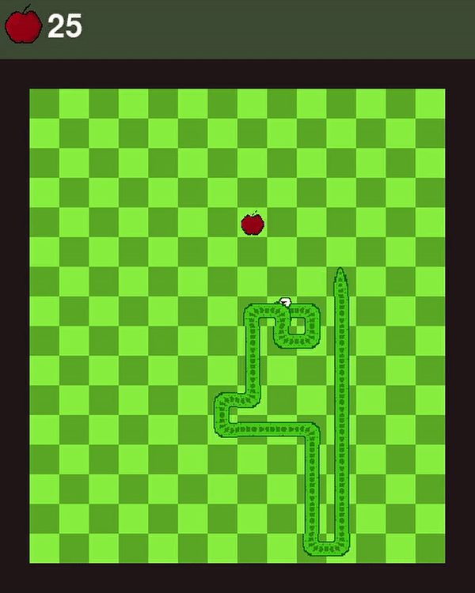
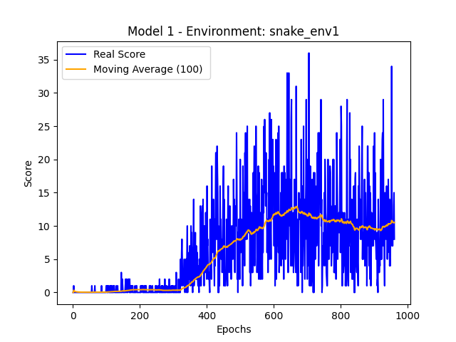
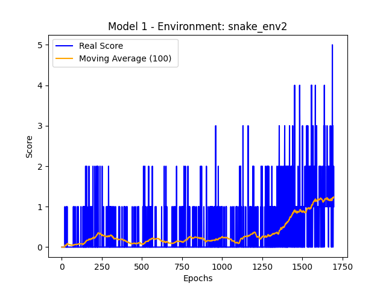
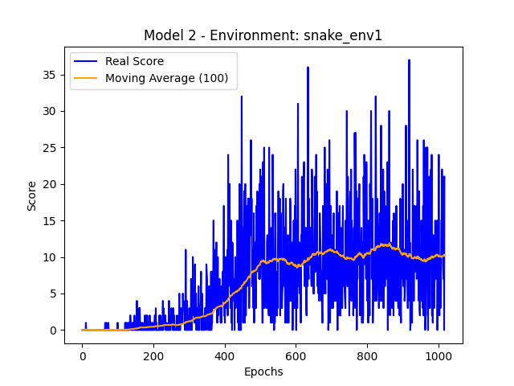
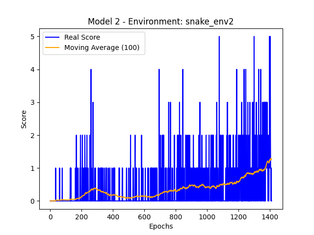

# SNAKE-AI
Implementação de uma IA para o jogo SNAKE utilizando Reinforcement Learning, feita com base no projeto [snake-game](https://github.com/RafaelMarasca/snake-game).

# INSTALAÇÃO

A solução foi concebida utilizando a linguagem Python3 e requer que estejam instalados os seguintes módulos (em parênteses estão elencados as versões dos respectivos módulos do meu ambiente no momento da execução):
    
* pygame (2.1.0) - `$ pip install pygame`
* tensorflow (2.8.0) - `$ pip install tensorflow`
* keras (2.8.0) - `$ pip install keras`
* numpy (1.22.3) - `$ pip install numpy`
* matplotlib (3.5.1) - `$ pip install matplotlib`
* keras-rl2 (1.0.5) - `$ pip install keras-rl2`
* gym (0.21.0) - `$ pip install gym`
    
Os arquivos finais resultantes da implementação são divididos em 4 scripts .py: snake.py, snake_env.py, train.py e test.py, bem como  1 pasta (assets) contendo as imagens necessárias para a exibição do jogo.  A seguir são apresentados os pontos mais relevantes de cada um dos arquivos de implementação.

## snake.py

Este arquivo é responsável pela implementação do jogo em SNAKE em si. Aqui, foi implementada uma classe Game, cujo objetivo é permitir a interface do agente inteligente com o jogo. Por conseguinte, ao executar o script com o comando: `$ python snake.py` é possível jogar o jogo utilizando as setas do teclado.

## snake_env.py

Este arquivo é responsável por criar os ambientes de treinamento através da API [OpenAI gym](https://www.gymlibrary.ml/). gym é uma biblioteca python que permite a criação de ambientes de teste para algoritmos e modelos de aprendizado por reforço. Basicamente ele implementa uma interface padronizada entre o ambiente e o agente.

Através desta API foram implementados dois ambientes gym para a interface do jogo com o agente, sendo estes snake_env1 e snake_env2. Estes ambientes apresentam mesmo espaço de ações, mas se diferenciam pelo espaço de observação implementado.

## train.py

Neste script são definidas duas arquiteturas diferentes de redes neurais profundas, designarei cada uma destas arquiteturas como Model1 e Model2.
Este script tem por objetivo implementar o treinamento do agente com base nos ambientes definidos em snake_env.py para que seja possível comparar os resultados e escolher a combinação de rede neural e ambiente que produza o melhor resultado. A rede neural funciona como a função de decisão do agente, ao receber o estado atual como entrada, produz como saída a ação que o agente deve tomar.

Ao rodar este script, o treinamento é iniciado e cada um dos modelos de rede neural são treinados com ambos os ambientes gym, snake_env1 e snake_env2, por 100000 passos. Durante o treinamento são gerados gráficos para cada uma das combinações contendo a série histórica das pontuações feitas por cada um dos agentes ao longo do treinamento, bem como a média móvel dos últimos 100 episódios. Ao fim do treinamento, os pesos da rede Q e os gráficos são salvos em uma pasta com o nome Model(x)Env(y), onde (x) designa a arquitetura da rede neural utilizada (1 para model1 e 2 para model2) e (y) designa o ambiente gym utilizado (1 para snake_env1 e 2 para snake_env2). 

## test.py

Este script se destina ao teste dos modelos treinados. Ele basicamente apenas realiza o carregamento dos pesos salvos anteriormente pelo módulo train.py e faz com que o agente treinado jogue o jogo. O jogo e os movimentos executados pelo agente são exibidos na tela em tempo real.
        
Para a execução desse módulo é necessário passar como parâmetro de linha de comando o nome do arquivo do com o treinamento desejado, seguido de 2 números, o primeiro indicando o modelo de arquitetura utilizado (1 para Model1 e 2 para Model2) e o segundo indicando o ambiente utilizado (1 para snake_env1 e 2 para snake_env2). Por exemplo, para executar o agente que foi treinado com a arquitetura de rede neural do tipo model2 utilizando o ambiente snake_env1, utiliza-se o seguinte comando: `$ python test.py Model2Env1 2 1`

# ALGUNS RESULTADOS

  
  

  
  

